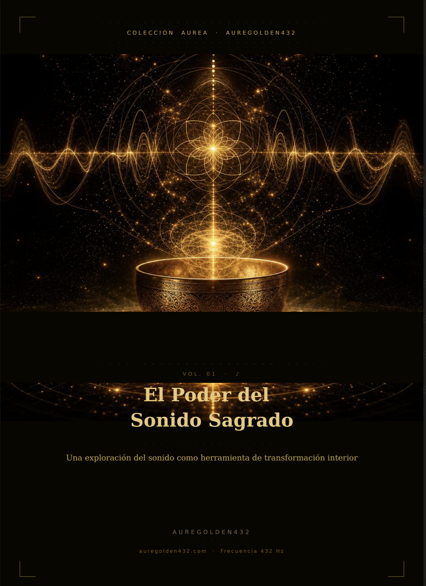
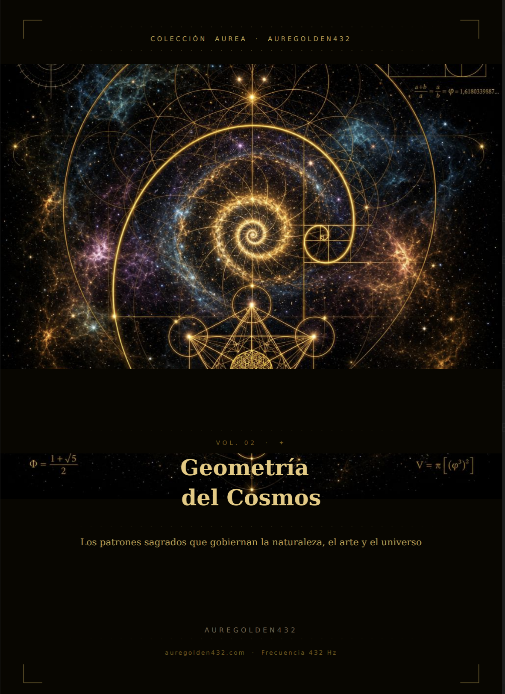
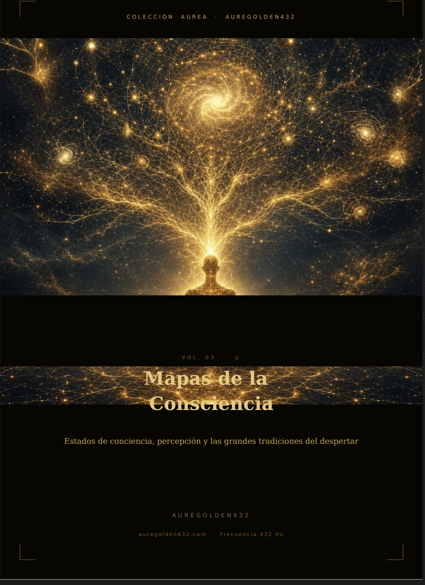
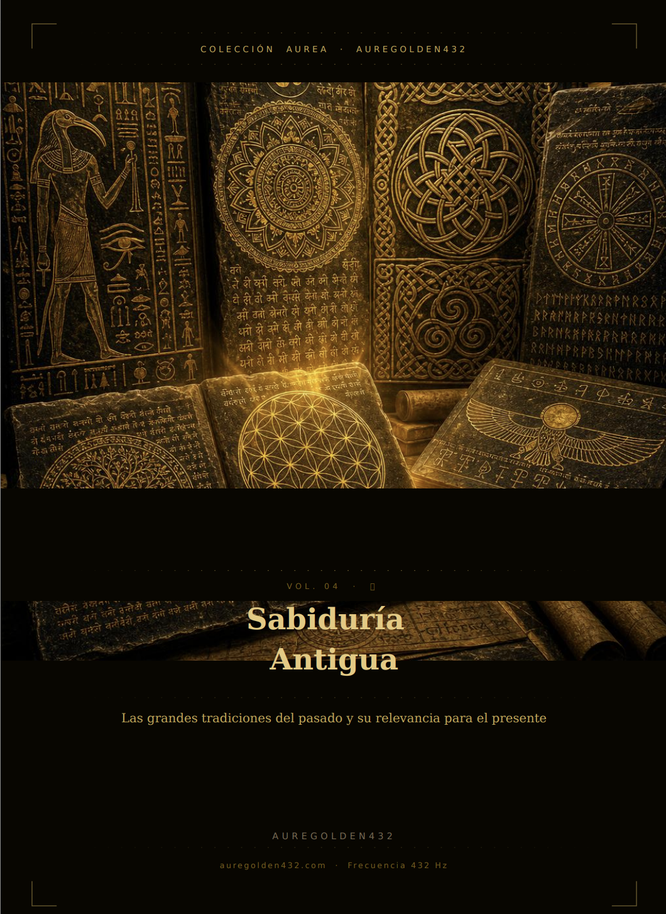
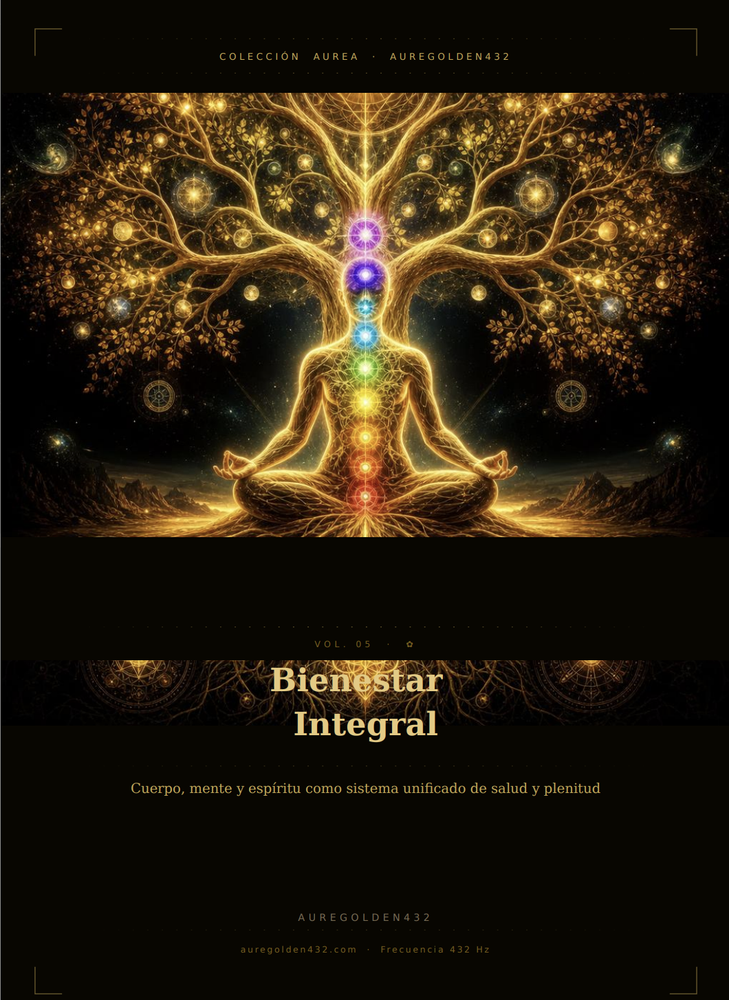
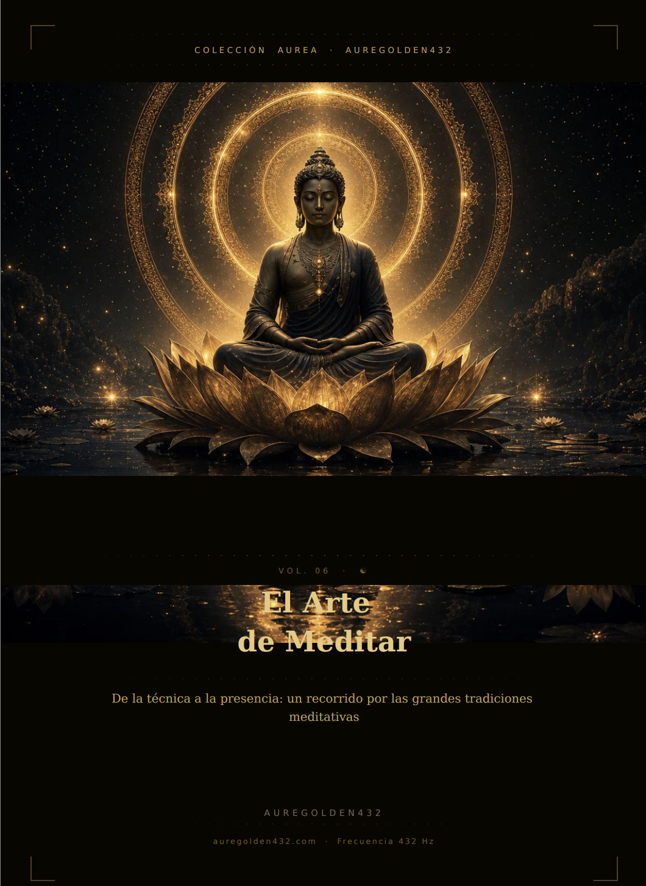

# 🌟 Auregolden432hz: Colección Áurea

<p align="center">
  
</p>

> *"Lux in Tenebris Lucet"* — El sonido es la más íntima de las artes: penetra en nosotros sin permiso y nos recuerda que somos, antes que todo, seres que vibran [3]. Que los 432 Hz sean tu sintonía de regreso a casa [3].

---

## 🌀 Bienvenidos a Auregolden432hz

**Auregolden432hz** es un ecosistema de conocimiento, ciencia, filosofía y herramientas de procesamiento de audio dedicadas al estudio de la frecuencia **432 Hz** y la expansión de la consciencia. Este repositorio alberga la **Colección Áurea**, una serie de seis obras literarias que integran de forma sistemática la acústica, la geometría del cosmos, la neurociencia contemplativa, la sabiduría perenne y las prácticas meditativas, proporcionando un puente entre la ciencia de vanguardia y el misticismo antiguo.

Además, aquí encontrarás herramientas de código abierto como nuestro procesador de señal analógico-digital para re-afinar música a 432 Hz y flujos de trabajo avanzados para co-creación literaria rigurosa.

---

## 📚 Anatomía de la Colección Áurea

La **Colección Áurea** consta de 6 volúmenes interconectados, diseñados y escritos por **AureGolden432** (Edición 2026) [1]. Cada volumen aborda una dimensión específica de la realidad vibratoria, desde la física del sonido hasta el silencio de la meditación pura.

---

### Vol. I: El Poder del Sonido Sagrado
<table align="center" width="100%">
  <tr>
    <td width="35%" align="center">
      <!-- Reemplaza esta ruta local por la imagen de tu portada si clonas el repositorio -->
      
    </td>
    <td width="65%" valign="top">
      <h4>♪ Una exploración del sonido como herramienta de transformación interior [1]</h4>
      <p>Este volumen seminal establece la vibración como el fundamento constitutivo del universo, uniendo los hallazgos de la física cuántica con las cosmovisiones del misticismo perenne (<em>Nada Brahma</em>) [92]. Explora la historia del sonido en rituales prehistóricos (como el diseño acústico de cuevas rupestres) [93] y detalla los mecanismos fisiológicos de la <strong>resonancia simpática</strong> [94], el <em>humming</em> y la tonificación como activadores del sistema nervioso parasimpático y reguladores de la salud [94].</p>
      <ul>
        <li><strong>Conceptos clave:</strong> Resonancia simpática, bioacústica, psicoacústica, tonificación, fundamentos vibratorios celulares [92, 94].</li>
        <li><strong>Frecuencia insignia:</strong> 432 Hz como sintonía orgánica de coherencia biológica [3].</li>
      </ul>
    </td>
  </tr>
</table>

---

### Vol. II: Geometría del Cosmos
<table align="center" width="100%">
  <tr>
    <td width="35%" align="center">
      
    </td>
    <td width="65%" valign="top">
      <h4>✦ Los patrones sagrados que gobiernan la naturaleza, el arte y el universo [4]</h4>
      <p>Una investigación sobre el lenguaje matemático y las proporciones que estructuran el macrocosmos y el microcosmos [7]. Analiza la omnipresencia de la <strong>Proporción Áurea (Phi - 1.618...)</strong> en la anatomía, el crecimiento de los seres vivos y las galaxias [10, 11]. Conecta de forma matemática la geometría tridimensional de los <strong>sólidos platónicos</strong> con la <strong>Flor de la Vida</strong> [16], y demuestra mediante la física de la <strong>Cimatía</strong> (haciendo visible el sonido) cómo las frecuencias armónicas organizan directamente la estructura de la materia [18, 19].</p>
      <ul>
        <li><strong>Conceptos clave:</strong> Número de oro (φ), secuencia de Fibonacci, espiral áurea, sólidos platónicos, cimatía de Hans Jenny [10, 16, 17, 18].</li>
        <li><strong>Aplicación práctica:</strong> Integración de proporciones armónicas en el diseño de espacios conscientes y arquitectura sagrada [20, 117].</li>
      </ul>
    </td>
  </tr>
</table>

---

### Vol. III: Mapas de la Consciencia
<table align="center" width="100%">
  <tr>
    <td width="35%" align="center">
      
    </td>
    <td width="65%" valign="top">
      <h4>◎ Estados de conciencia, percepción y las grandes tradiciones del despertar [26]</h4>
      <p>Aborda el "problema difícil" de la conciencia formulado por David Chalmers [127] y traza una cartografía fenomenológica de la mente humana. Integra de forma magistral las taxonomías cognitivas del budismo (<em>Abhidharma</em>), los estados de absorción mental en el yoga tradicional y la psicología transpersonal de Maslow y Grof [27, 29, 30]. Todo esto es contrastado con los descubrimientos de la <strong>neurociencia contemplativa</strong>, revelando la neuroplasticidad del cerebro meditador y la sincronización de las ondas cerebrales [127, 129].</p>
      <ul>
        <li><strong>Conceptos clave:</strong> Problema difícil de la conciencia, estados no ordinarios, neurociencia contemplativa, ondas gamma, kundalini y fisiología sutil [27, 28, 129].</li>
        <li><strong>Enfoque:</strong> El "despertar" (satori, moksha) como una transformación estable en la relación de la conciencia consigo misma [31, 130].</li>
      </ul>
    </td>
  </tr>
</table>

---

### Vol. IV: Sabiduría Antigua
<table align="center" width="100%">
  <tr>
    <td width="35%" align="center">
      
    </td>
    <td width="65%" valign="top">
      <h4>📜 Las grandes tradiciones del pasado y su relevancia para el presente [34]</h4>
      <p>Un exhaustivo recorrido histórico y filosófico por las tecnologías de desarrollo espiritual de las civilizaciones antiguas. Desde la <strong>tradición hermética</strong> del Egipto faraónico y su Corpus Hermeticum [38], pasando por la Grecia clásica y sus escuelas mistéricas (los Misterios de Eleusis) [144], hasta adentrarse en la no-dualidad de los <strong>Upanishads</strong> en la India antigua [36, 143] y el fluir espontáneo del <strong>Taoísmo</strong> (<em>wu wei</em>) en China [36].</p>
      <ul>
        <li><strong>Conceptos clave:</strong> Principios herméticos ("Como es arriba, es abajo") [40], ejercicios espirituales de Pierre Hadot [37], Advaita Vedanta, Mahavakyas [143].</li>
        <li><strong>Objetivo:</strong> Extraer de manera pragmática principios de vida perennes para navegar el acelerado mundo contemporáneo [35, 147].</li>
      </ul>
    </td>
  </tr>
</table>

---

### Vol. V: Bienestar Integral
<table align="center" width="100%">
  <tr>
    <td width="35%" align="center">
      
    </td>
    <td width="65%" valign="top">
      <h4>✿ Cuerpo, mente y espíritu como sistema unificado de salud y plenitud [44]</h4>
      <p>Propone una crítica constructiva al enfoque de especialización biomédica y recupera una visión sistémica e integradora de la salud humana [45, 150]. Fundamentado en la **psiconeuroinmunología** y la medicina mente-cuerpo, explora la interocepción (escucha corporal) [46, 152], el poder de la neuroplasticidad autodirigida mediante el entrenamiento mental [153], y la importancia neurobiológica del descanso profundo, la alimentación consciente y las relaciones interpersonales [45, 150].</p>
      <ul>
        <li><strong>Conceptos clave:</strong> Psiconeuroinmunología, Teoría Polivagal, interocepción, neurobiología del sueño, alimentación intuitiva, longevidad relacional [45, 46, 151].</li>
        <li><strong>Práctica:</strong> Herramientas para regular el sistema nervioso y encarnar la salud desde la auto-observación cotidiana [46, 152].</li>
      </ul>
    </td>
  </tr>
</table>

---

### Vol. VI: El Arte de Meditar
<table align="center" width="100%">
  <tr>
    <td width="35%" align="center">
      
    </td>
    <td width="65%" valign="top">
      <h4>☯ De la técnica a la presencia: un recorrido por las grandes tradiciones meditativas [48]</h4>
      <p>Una guía técnica, práctica y desmitificada de las principales prácticas contemplativas del mundo. El texto aborda desde la postura física y el trabajo inicial con la corriente de pensamientos, hasta la profundización en los linajes de meditación Zen, Vipassana y Mindfulness secular [156]. Examina el papel insustituible de la Sangha (comunidad) y la relación maestro-discípulo (dokusan) como catalizadores del progreso interior [157].</p>
      <ul>
        <li><strong>Conceptos clave:</strong> Defusión cognitiva, atención plena, zazen, tres pilares del sendero (Sila, Samadhi, Prajna), el silencio como revelador de la presencia pura [156, 157].</li>
        <li><strong>Enfoque:</strong> La meditación como un sendero no-lineal de auto-descubrimiento y consistencia compasiva [156].</li>
      </ul>
    </td>
  </tr>
</table>

---

## 🛠️ Herramientas Tecnológicas

Este repositorio incluye herramientas diseñadas para unificar la tecnología con el propósito vibratorio de la **Colección Áurea**:

### 🎵 1. Conversor de Audio a 432 Hz (`pitch_shifter_432hz.py`)
Un script en Python de procesamiento de señal acústica profesional para re-afinar de forma óptima pistas de audio desde el estándar A=440 Hz hasta A=432 Hz.

*   **Método Analógico (`--method analog`):** Ralentiza la pista un **1.82%**, imitando físicamente la desaceleración de una cinta o vinilo. **100% libre de artefactos digitales**, ideal para audiófilos por su sonido cálido y orgánico.
*   **Método Digital (`--method dsp`):** Utiliza un *vocoder de fase* para aplicar un desplazamiento de **-31.77 cents**, bajando el tono fundamental de A4 a 432 Hz **sin alterar el tempo ni la duración de la canción**.

**Instalación rápida:**
```bash
pip install numpy soundfile librosa pydub
```
**Conversión recomendada (Analógica):**
```bash
python pitch_shifter_432hz.py -i entrada_440.mp3
```

### 🧠 2. Skill de Escritor e Investigador para Claude (`claude-432hz-writer-skill.md`)
Un robusto conjunto de instrucciones (*System Prompt*) de grado académico para interactuar con la Inteligencia Artificial (Claude). Permite auditar textos, expandir capítulos o generar contenidos adicionales bajo un estándar estrictamente científico e histórico, descartando mitos y asegurando el rigor musicológico de tus publicaciones.

---

## 🔬 Rigor Científico e Histórico: El Verdadero Camino de los 432 Hz

Este proyecto nace bajo la premisa de la honestidad intelectual, separando el valor estético, el trasfondo de diseño y el impacto biológico real del sonido de las teorías de conspiración infundadas que abundan en la red [56]:

1.  **La Afinación de Verdi (Orígenes del 432 Hz):** En el siglo XIX, los teatros elevaron gradualmente el tono para lograr mayor brillantez ("inflación del tono"). En respuesta, el compositor **Giuseppe Verdi** abogó apasionadamente en la década de 1880 ante la comisión musical italiana para decretar un estándar de **A=432 Hz**, buscando proteger el aparato vocal de los cantantes de la tensión excesiva de afinaciones más altas (como el A=450 de la época en Roma) [56].
2.  **El Tono Científico (Do = 256 Hz):** Propuesto originalmente por el físico francés **Joseph Sauveur** en 1713, fija la nota Do central en 256 Hz [57]. Esto permite que todas las octavas de Do sean números enteros exactos en base binaria (potencias de 2) hasta llegar a 1 Hz [57]. En esta escala pura, la nota La armónica se asienta matemáticamente en **430.54 Hz** [57]. Los 432 Hz modernos corresponden a una aproximación pragmática de este sistema de Do=256 Hz [57].
3.  **Desmitificando el Origen de los 440 Hz:** Es un mito generalizado de internet que el Ministro de Propaganda alemán Joseph Goebbels impuso los 440 Hz en 1939 para inducir agresividad en las masas [56]. Históricamente, la estandarización internacional de los 440 Hz en la **Conferencia de Londres de 1939** fue liderada por el Instituto de Estándares Británico (BSI) [58] debido a necesidades comerciales y de radiodifusión, ya que frecuencias anteriores como 439 Hz eran números primos extremadamente difíciles de estabilizar y generar con la electrónica de oscilación de la BBC en aquella época.
4.  **Ciencia Médica y Psicoacústica Actual:** Aunque no existe evidencia creíble de que los 432 Hz "curen el ADN" o "resuenen mágicamente con la frecuencia Schumann" (que es electromagnética y no acústica) [56], **estudios clínicos piloto doble ciego y cruzados** (liderados por investigadores como Diletta Calamassi) han observado que escuchar música afinada a 432 Hz disminuye de manera significativa la frecuencia cardíaca en comparación con los 440 Hz [56], y produce mejoras cuantificables en la calidad del sueño y la relajación del estrés en pacientes clínicos [56].

---

## 🚀 Cómo Empezar a Usar este Repositorio

1.  **Explora el Índice Maestro:** Abre [`coleccion-aurea-indice-maestro.md`](./coleccion-aurea-indice-maestro.md) en tu navegador de GitHub para ver la estructura capitular unificada y seguir los itinerarios de lectura cruzada sugeridos.
2.  **Configura tu Co-Escritor:** Carga el Prompt [`claude-432hz-writer-skill.md`](./claude-432hz-writer-skill.md) en Claude para interactuar de forma avanzada con la temática del sonido y la conciencia.
3.  **Re-afina tu Música:** Descarga [`pitch_shifter_432hz.py`](./pitch_shifter_432hz.py) y comienza a experimentar de primera mano la diferencia perceptiva de las dos afinaciones.

---

*Desarrollado y mantenido con devoción al sonido, el arte y la presencia por **Auregolden432** (2026).* [1]
